# LiteFlow逻辑可视化编排功能原型


## 项目启动步骤

- 1. 安装依赖：

```bash
$ yarn
```

- 2. 启动服务：

```bash
$ yarn start
```

以下是对[LiteFlow](https://liteflow.cc/)逻辑可视化编排的实现说明。

# 01-先导篇

作为一名前端开发，我们需要特别关注的前端开发要素有三个——数据（Model）、视图（View）和逻辑（Control），即“MVC”——而在实现[LiteFlow](https://liteflow.cc/)逻辑可视化编排时，我们也可以使用“MVC三要素”的知识框架来进行系统的拆解、组合、设计和实现。


1. 数据模型（Model）：将EL表达式的操作符（Operator）进行建模，在这个项目里，我们将EL表达式建模成了由ELNode组成的一棵树；
2. 视图呈现（View）：使用AntV X6的节点（Node）和边（Edge）进行ELNode的可视化呈现，即通过Nodes & Edges实现[LiteFlow](https://liteflow.cc/)的逻辑可视化；
3. 操作逻辑（Control）：实现ELNode模型的增删改查（CRUD）操作。

我个人非常喜欢这个“MVC三要素”的知识框架，通过它、我可以很方便地进行系统的拆解和组合，所以本篇文章、以及本系列文章，都会以这个“MVC三要素”的知识框架进行分享。

在本篇先导篇中，我们先简单地过一下[LiteFlow](https://liteflow.cc/)逻辑可视化编排的“MVC三要素”：

## 1、数据模型（Model）

[LiteFlow](https://liteflow.cc/)对可执行的逻辑流程进行建模，主要包括以下2个部分：


- 1、逻辑组件（组件节点）：逻辑组件类型包括： <br/>
① 顺序组件：用于THEN、WHEN； <br/>
② 分支组件：用于SWITCH、IF ...； <br/>
③ 循环组件：用于FOR、WHILE ...。 <br/>

- 2、逻辑编排：通过EL表达式进行组件编排： <br/>
  ① 串行编排：THEN； <br/>
  ② 并行编排：WHEN； <br/>
  ③ 选择编排：SWITCH； <br/>
  ④ 条件编排：IF； <br/>
  ⑤ 循环编排：FOR、WHILE等等。

而对以上“逻辑组件”的“逻辑编排”，都是通过EL表达式来实现，比如一个EL表达式的例子：

```typescript
<chain name="chain1">
    THEN(
        a,
        WHEN(b, c, d),
        e
    );
</chain>
```

其中“THEN”和“WHEN”是EL表达式的关键字，分别表示串行编排和并行编排，而“a”“b”“c”“d”“e”则是5个逻辑组件，由此组成了一个串行和并行编排的组合——即先执行“a”组件，然后并行执行“b”“c”“d”组件，最后执行“e”组件。

而我们数据模型（Model），就是将EL表达式的操作符（Operator）进行建模：


- EL表达式：[LiteFlow](https://liteflow.cc/)的逻辑编排是通过EL表达式来实现的，比如我们之前提到过的这个例子：
```typescript
<chain name="chain1">
    THEN(
        a,
        WHEN(b, c, d),
        e
    );
</chain>
```
- 树形结构：将[LiteFlow](https://liteflow.cc/)进行文本拆解，我们其实能得到一个树形结构（即AST抽象语法树）；
- JSON表示：我们可以把这棵树进行简化，得到一个简化版的JSON表示：
```typescript
{
  type: "THEN",
  children: [
    { type: "NodeComponent", id: "a" },
    {
      type: "WHEN",
      children: [
        { type: "NodeComponent", id: "b" },
        { type: "NodeComponent", id: "c" },
        { type: "NodeComponent", id: "d" },
      ],
    },
    { type: "NodeComponent", id: "e" },
  ]
}
```
- 建立模型：经过以上步骤的分析，我们可以建立这么一个ELNode模型：
```typescript
/**
 * EL表达式的模型表示：数据结构本质上是一个树形结构。
 * 例如一个串行编排(THEN)：
  {
    type: ConditionTypeEnum.THEN,
    children: [
      { type: NodeTypeEnum.COMMON, id: 'a' },
      { type: NodeTypeEnum.COMMON, id: 'b' },
      { type: NodeTypeEnum.COMMON, id: 'c' },
      { type: NodeTypeEnum.COMMON, id: 'd' },
    ],
  }
 */
export default abstract class ELNode {
  // 节点类型：可以是编排类型，也可以是组件类型
  public type: ConditionTypeEnum | NodeTypeEnum;
  // 当前节点的子节点：编排类型有子节点，组件类型没有子节点
  public children?: ELNode[];
  // 当前节点的父节点
  public parent?: ELNode;
  // 判断类节点类型：主要用于SWITCH/IF/FOR/WHILE等编排类型
  public condition?: ELNode;
  // 组件节点的id
  public id?: string;
  // 编排节点的属性：可以设置id/tag等等
  public properties?: Properties;
}
```

## 2、视图呈现（View）

在实现[LiteFlow](https://liteflow.cc/)逻辑可视化编排时，我们使用的图编辑引擎是[AntV X6](https://x6.antv.vision/zh/)——不光因为它足够好用、我们很常用，而且我们用起来也挺有心得，感兴趣的朋友可以看我之前写的文章：[「AntV X6」从5个核心要素出发，快速上手AntV X6图可视化编排](https://juejin.cn/post/7326766014258855972)。


我们目前初步实现了[LiteFlow](https://liteflow.cc/)的以下3类/6种逻辑可视化：

- 1、顺序类：串行编排（THEN）、并行编排（WHEN）；
- 2、分支类：选择编排（SWITCH）、条件编排（IF）；
- 3、循环类：FOR循环、WHILE循环。

我之前写过一篇文章：《[Liteflow逻辑编排可视化设计](https://juejin.cn/post/7357231056288972840)》，感兴趣的朋友可以先看一看。

## 3、操作逻辑（Control）


[LiteFlow](https://liteflow.cc/)的逻辑可视化编排，主要是实现对ELNode模型的增删改查操作：


为了方便使用，我们不光实现了通过拖拽（Drag & Drop）添加节点，而且在画布中也实现了通过快捷面板（ContextPad），在节点和边上快速新增节点。

而针对ELNode的“增删改查”，我们可以在ELNode中通过定义如下相应的方法进行实现：

```typescript
export default abstract class ELNode {
  /////// 接着上面步骤 1.数据模型（Model）
  /**
   * 添加子节点
   * @param child 子节点
   * @param index 指定位置
   */
  public appendChild(child: ELNode, index?: number);

  /**
   * 删除指定的子节点
   * @param child 子节点
   */
  public removeChild(child: ELNode): boolean;
  
  /**
   * 创建新的节点
   * @param parent 父节点
   */
  public create(parent: ELNode, type?: NodeTypeEnum): ELNode

  /**
   * 删除当前节点
   */
  public remove(): boolean;

  /**
   * 转换为X6的图数据格式
   */
  public toCells(
    previous?: Node,
    cells?: Cell[],
    options?: Record<string, any>,
  ): Cell[] | Node;
  
  /**
   * 转换为EL表达式字符串
   */
  public toEL(): string;
}
```


# 02-数据模型篇（Model）

回顾一下我们在《[先导篇](https://juejin.cn/spost/7365694439568343080)》中提到过的内容，作为一名前端开发，我们需要特别关注的要素有三个——数据（Model）、视图（View）和逻辑（Control），即“MVC”——我接下来也是使用“MVC三要素”的知识框架来进行LiteFlow逻辑可视化编排系统的拆解、组合、设计和实现的：


而“数据”，或者“模型”，或者“数据模型”，或者“概念模型”，是我们开发之前需要最先分析和设计的部分，而具体到对LiteFlow进行逻辑可视化编排的模型设计上，我们的目标是将EL表达式的操作符（Operator）进行建模，最终我们将EL表达式建模成了由ELNode组成的一棵树：


## 1、EL表达式

[LiteFlow](https://liteflow.cc/)的逻辑编排，都是通过EL表达式来实现，比如一个EL表达式的例子：

```typescript
<chain name="chain1">
    THEN(
        a,
        WHEN(b, c, d),
        e
    );
</chain>
```

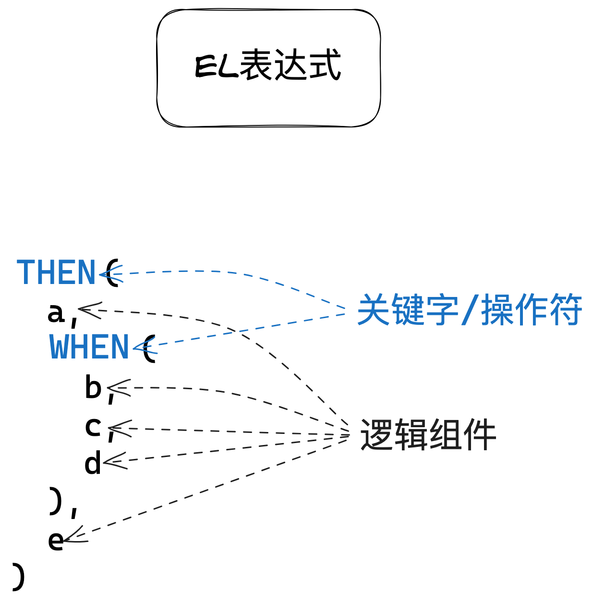

其中“THEN”和“WHEN”是EL表达式的关键字，分别表示串行编排和并行编排，而“a”“b”“c”“d”“e”则是5个逻辑组件，由此组成了一个串行和并行编排的组合——即先执行“a”组件，然后并行执行“b”“c”“d”组件，最后执行“e”组件。

[LiteFlow](https://liteflow.cc/)对可执行的逻辑流程进行建模，主要包括以下2个部分：


- 1、逻辑组件（组件节点）：逻辑组件类型包括： <br/>
① 顺序组件：用于THEN、WHEN； <br/>
② 分支组件：用于SWITCH、IF ...； <br/>
③ 循环组件：用于FOR、WHILE ...。 <br/>

- 2、逻辑编排：通过EL表达式进行组件编排： <br/>
  ① 串行编排：THEN； <br/>
  ② 并行编排：WHEN； <br/>
  ③ 选择编排：SWITCH； <br/>
  ④ 条件编排：IF； <br/>
  ⑤ 循环编排：FOR、WHILE等等。

在这个项目里，我们的首要任务就是将EL表达式的操作符（Operator）进行建模，最终我们将EL表达式建模成了由ELNode组成的一棵树。

## 2、树形结构：

将[LiteFlow](https://liteflow.cc/)的EL表达式进行文本拆解，我们其实能得到一个树形结构:

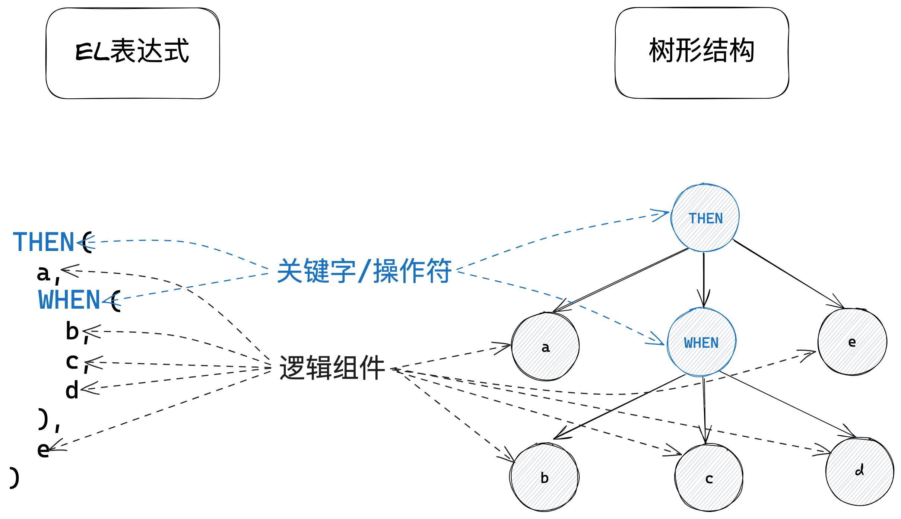

上面的树形结构来自于AST抽象语法树，使用[AST explorer](https://astexplorer.net/)解析的完整的AST语法树如下所示：

```typescript
{
  "type": "Program",
  "start": 0,
  "end": 34,
  "body": [
    {
      "type": "ExpressionStatement",
      "start": 0,
      "end": 34,
      "expression": {
        "type": "CallExpression",
        "start": 0,
        "end": 33,
        "callee": {
          "type": "Identifier",
          "start": 0,
          "end": 4,
          "name": "THEN"
        },
        "arguments": [
          {
            "type": "Identifier",
            "start": 8,
            "end": 9,
            "name": "a"
          },
          {
            "type": "CallExpression",
            "start": 13,
            "end": 26,
            "callee": {
              "type": "Identifier",
              "start": 13,
              "end": 17,
              "name": "WHEN"
            },
            "arguments": [
              {
                "type": "Identifier",
                "start": 18,
                "end": 19,
                "name": "b"
              },
              {
                "type": "Identifier",
                "start": 21,
                "end": 22,
                "name": "c"
              },
              {
                "type": "Identifier",
                "start": 24,
                "end": 25,
                "name": "d"
              }
            ],
            "optional": false
          },
          {
            "type": "Identifier",
            "start": 30,
            "end": 31,
            "name": "e"
          }
        ],
        "optional": false
      }
    }
  ],
  "sourceType": "module"
}
```

## 3、JSON表示

我们可以把这棵AST抽象语法树进行简化，得到一个简化版的JSON表示：


```typescript
{
  type: "THEN",
  children: [
    { type: "NodeComponent", id: "a" },
    {
      type: "WHEN",
      children: [
        { type: "NodeComponent", id: "b" },
        { type: "NodeComponent", id: "c" },
        { type: "NodeComponent", id: "d" },
      ],
    },
    { type: "NodeComponent", id: "e" },
  ]
}
```

上面这个JSON数据表示，就是我们的目标格式，也是我们打算前后端进行数据交换的标准格式。

## 4、建立模型


经过以上步骤的分析，我们可以建立这么一个ELNode模型：

```typescript
/**
 * EL表达式的模型表示：数据结构本质上是一个树形结构。
 * 例如一个串行编排(THEN)：
 * (1) EL表达式形式：THEN(a, b, c, d)
 * (2) JSON表示形式：
 * {
    type: ConditionTypeEnum.THEN,
    children: [
      { type: NodeTypeEnum.COMMON, id: 'a' },
      { type: NodeTypeEnum.COMMON, id: 'b' },
      { type: NodeTypeEnum.COMMON, id: 'c' },
      { type: NodeTypeEnum.COMMON, id: 'd' },
    ],
  }
 * (3) 通过ELNode节点模型表示为：
                                          ┌─────────────────┐
                                      ┌──▶│  NodeOperator   │
                                      │   └─────────────────┘
                                      │   ┌─────────────────┐
                                      ├──▶│  NodeOperator   │
  ┌─────────┐    ┌─────────────────┐  │   └─────────────────┘
  │  Chain  │───▶│  ThenOperator   │──┤   ┌─────────────────┐
  └─────────┘    └─────────────────┘  ├──▶│  NodeOperator   │
                                      │   └─────────────────┘
                                      │   ┌─────────────────┐
                                      └──▶│  NodeOperator   │
                                          └─────────────────┘
 */
export default abstract class ELNode {
  // 节点类型：可以是编排类型，也可以是组件类型
  public type: ConditionTypeEnum | NodeTypeEnum;
  // 当前节点的子节点：编排类型有子节点，组件类型没有子节点
  public children?: ELNode[];
  // 当前节点的父节点
  public parent?: ELNode;
  // 判断类节点类型：主要用于SWITCH/IF/FOR/WHILE等编排类型
  public condition?: ELNode;
  // 组件节点的id
  public id?: string;
  // 编排节点的属性：可以设置id/tag等等
  public properties?: Properties;
}
```


对于我们建立的ELNode模型，关键点有以下2个：

1. 组合关系：一个EL表达式，最终是由ELNode组成的一棵树；
 - 这棵树的根节点被我们定义为Chain，其他EL操作符（比如THEN/WHEN/SWITCH等关键字，也包括逻辑组件）都是树上的子节点；
 - 需要注意的是，逻辑组件（NodeComponent）也被当做一种操作符（Operator），而且是这棵树的叶子结点。
2. 继承关系：所有EL操作符（比如THEN/WHEN/SWITCH等)，包括逻辑组件（NodeComponent），都继承自ELNode，同时有自己的特有属性和方法实现。

```typescript
/**
 * EL表达式各个操作符模型，继承关系为：
                      ┌─────────────────┐
                  ┌──▶│  ThenOperator   │
                  │   └─────────────────┘
                  │   ┌─────────────────┐
                  ├──▶│  WhenOperator   │
                  │   └─────────────────┘
                  │   ┌─────────────────┐
                  ├──▶│  SwitchOperator │
                  │   └─────────────────┘
  ┌──────────┐    │   ┌─────────────────┐
  │  ELNode  │────┼──▶│  IfOperator     │
  └──────────┘    │   └─────────────────┘
                  │   ┌─────────────────┐
                  ├──▶│  ForOperator    │
                  │   └─────────────────┘
                  │   ┌─────────────────┐
                  ├──▶│  WhileOperator  │
                  │   └─────────────────┘
                  │   ┌─────────────────┐
                  └──▶│  NodeOperator   │
                      └─────────────────┘
 */
// 1. 顺序类
export { default as ThenOperator } from './then-operator';
export { default as WhenOperator } from './when-operator';
// 2. 分支类
export { default as SwitchOperator } from './switch-operator';
export { default as IfOperator } from './if-operator';
// 3. 循环类
export { default as ForOperator } from './for-operator';
export { default as WhileOperator } from './while-operator';
// 4. 节点类
export { default as NodeOperator } from './node-operator';
```

# 03-视图呈现篇（View）

回顾一下我们在《[先导篇](https://juejin.cn/spost/7365694439568343080)》中提到过的内容，作为一名前端开发，我们需要特别关注的要素有三个——数据（Model）、视图（View）和逻辑（Control），即“MVC”——我接下来也是使用“MVC三要素”的知识框架来进行LiteFlow逻辑可视化编排系统的拆解、组合、设计和实现的：


在《[数据模型篇](https://juejin.cn/spost/7366557738267426850)》中，我们完成了EL表达式的操作符（Operator）的建模工作，最终我们将EL表达式建模成了由ELNode组成的一棵树：


接下来，我们将使用AntV X6的节点（Node）和边（Edge）进行ELNode的可视化呈现，即通过Nodes & Edges实现[LiteFlow](https://liteflow.cc/)的逻辑可视化设计：


## 1、心法口诀：“两点一线”
如果把[LiteFlow](https://liteflow.cc/)的逻辑可视化的设计心法总结一下，那就可以总结为一句口诀：“两点一线”。因为我们从要素的拆解来看，一张图本质上无外乎就是「两点一线」——即节点和连线，以及在节点和连线上的文字标签。


我们对[LiteFlow](https://liteflow.cc/)的逻辑可视化设计，就是通过“节点”和“连线”的组合进行逻辑可视化呈现的。比如下面是[LiteFlow](https://liteflow.cc/)逻辑编排的根节点Chain的可视化设计：

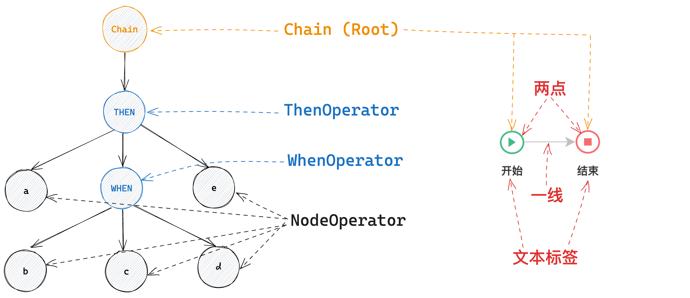

[LiteFlow](https://liteflow.cc/)逻辑编排的根节点Chain的可视化设计包括：

- 两点：即一个“开始节点”和一个“结束节点”；
- 一线：在“开始节点”和“结束节点”之间画一条线。

通过AntV X6进行“两点一线”的代码实现也相对简单，一个“两点一线”的参考实现如下：

```typescript
// 1. 首先：创建一个开始节点
const start: Node = Node.create({
  shape: 'liteflow-start',
  attrs: {
    label: { text: '开始' },
  },
});
// 2. 然后：创建一个结束节点
const end: Node = Node.create({
  shape: 'liteflow-end',
  attrs: {
    label: { text: '结束' },
  },
});
// 3. 最后：创建开始节点和结束节点之间的连线
Edge.create({
  shape: 'edge',
  source: start,
  target: end,
});
```

事实上，上面的代码就是我们对[LiteFlow](https://liteflow.cc/)逻辑可视化的实现代码，其他操作符（包括串行编排THEN、并行编排WHEN、条件编排IF等等）也是使用了同样“两点一线”的思路来实现的：


以下是我们分别对[LiteFlow](https://liteflow.cc/)各个逻辑编排的可视化设计和实现。

## 2、逻辑可视化编排设计与实现

### 2.1 串行编排：THEN

#### 1、文本（Liteflow EL）表达式

如果你要依次执行a,b,c,d四个组件，你可以用`THEN`关键字，需要注意的是，`THEN`必须大写。

```typescript
<chain name="chain1">
    THEN(a, b, c, d);
</chain>
```

#### 2、JSON表示形式

```typescript
{
    "type": "THEN",
    "children": [
        { "type": "NodeComponent", "id": "a" },
        { "type": "NodeComponent", "id": "b" },
        { "type": "NodeComponent", "id": "c" },
        { "type": "NodeComponent", "id": "d" },
    ]
}
```

#### 3、通过节点模型进行表示

```typescript
                                          ┌─────────────────┐
                                      ┌──▶│  NodeOperator   │
                                      │   └─────────────────┘
                                      │   ┌─────────────────┐
                                      ├──▶│  NodeOperator   │
  ┌─────────┐    ┌─────────────────┐  │   └─────────────────┘
  │  Chain  │───▶│  ThenOperator   │──┤   ┌─────────────────┐
  └─────────┘    └─────────────────┘  ├──▶│  NodeOperator   │
                                      │   └─────────────────┘
                                      │   ┌─────────────────┐
                                      └──▶│  NodeOperator   │
                                          └─────────────────┘
```

#### 4、可视化设计与实现


### 2.2 并行编排：WHEN

#### 1、文本（Liteflow EL）表达式

如果你要并行执行a,b,c,d四个组件，你可以用`WHEN`关键字，需要注意的是，`WHEN`必须大写。

```typescript
<chain name="chain1">
    WHEN(a, b, c, d)
</chain>
```

#### 2、JSON表示形式

```typescript
{
    "type": "THEN",
    "children": [
        { "type": "NodeComponent", "id": "a" },
        { "type": "NodeComponent", "id": "b" },
        { "type": "NodeComponent", "id": "c" },
        { "type": "NodeComponent", "id": "d" },
    ]
}
```

#### 3、通过节点模型进行表示

```typescript
                                          ┌─────────────────┐
                                      ┌──▶│  NodeOperator   │
                                      │   └─────────────────┘
                                      │   ┌─────────────────┐
                                      ├──▶│  NodeOperator   │
  ┌─────────┐    ┌─────────────────┐  │   └─────────────────┘
  │  Chain  │───▶│  WhenOperator   │──┤   ┌─────────────────┐
  └─────────┘    └─────────────────┘  ├──▶│  NodeOperator   │
                                      │   └─────────────────┘
                                      │   ┌─────────────────┐
                                      └──▶│  NodeOperator   │
                                          └─────────────────┘
```

#### 4、可视化设计与实现


### 2.3 选择编排：SWITCH

#### 1、文本（Liteflow EL）表达式

如果，根据组件a，来选择执行b,c,d中的一个，你可以如下声明：

``` typescript
<chain name="chain1">
    SWITCH(a).to(b, c, d);
</chain>
```

#### 2、JSON表示形式

```typescript
{
    "type": "SWITCH",
    "condition": { "type": "SwitchComponent", "id": "x" },
    "children": [
        { "type": "NodeComponent", "id": "a" },
        { "type": "NodeComponent", "id": "b" },
        { "type": "NodeComponent", "id": "c" },
        { "type": "NodeComponent", "id": "d" },
    ]
}
```

#### 3、通过节点模型进行表示

```typescript
                                          ┌─────────────────┐
                                      ┌──▶│  NodeOperator   │
                                      │   └─────────────────┘
                                      │   ┌─────────────────┐
                                      ├──▶│  NodeOperator   │
  ┌─────────┐    ┌─────────────────┐  │   └─────────────────┘
  │  Chain  │───▶│ SwitchOperator  │──┤   ┌─────────────────┐
  └─────────┘    └─────────────────┘  ├──▶│  NodeOperator   │
                                      │   └─────────────────┘
                                      │   ┌─────────────────┐
                                      └──▶│  NodeOperator   │
                                          └─────────────────┘
```

#### 4、可视化设计与实现


### 2.4 条件编排：IF

#### 1、文本（Liteflow EL）表达式

``` typescript
<chain name="chain1">
    IF(x, a);
</chain>
```

#### 2、JSON表示形式

```typescript
{
    "type": "IF",
    "condition": { "type": "IfComponent", "id": "x" },
    "children": [
        { "type": "NodeComponent", "id": "a" },
    ]
}
```

#### 3、通过节点模型进行表示

```typescript
                                          ┌─────────────────┐
                                      ┌──▶│  NodeOperator   │
  ┌─────────┐    ┌─────────────────┐  │   └─────────────────┘
  │  Chain  │───▶│    IfOperator   │──┤   ┌─────────────────┐
  └─────────┘    └─────────────────┘  └──▶│  NodeOperator   │
                                          └─────────────────┘
```

#### 4、可视化设计与实现

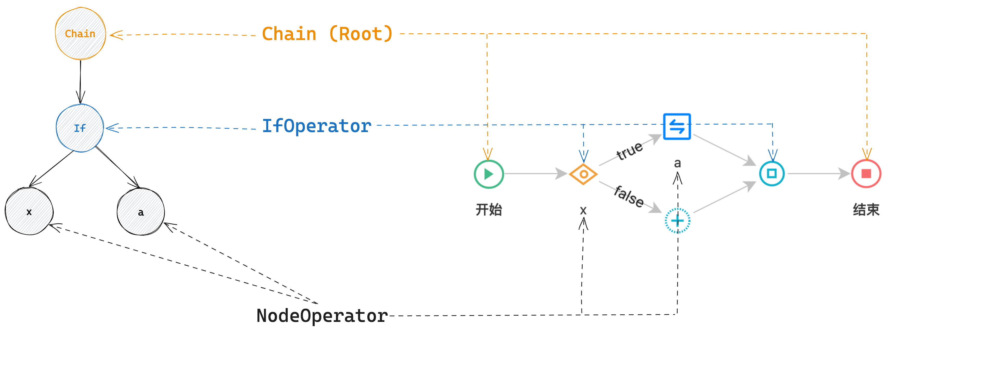

### 2.5 循环编排：FOR

#### 1、文本（Liteflow EL）表达式

``` typescript
<chain name="chain1">
    FOR(f).DO(THEN(a, b));
</chain>
```

#### 2、JSON表示形式

```typescript
{
    "type": "FOR",
    "condition": { "type": "ForComponent", "id": "f" },
    "children": [
        {
            "type": "THEN",
            "children": [
                { "type": "NodeComponent", "id": "a" },
                { "type": "NodeComponent", "id": "b" },
            ]
        }
    ]
}
```

#### 3、通过节点模型进行表示

```typescript
                                          ┌─────────────────┐
                                      ┌──▶│  NodeOperator   │
  ┌─────────┐    ┌─────────────────┐  │   └─────────────────┘      ┌─────────────────┐
  │  Chain  │───▶│   ForOperator   │──┤   ┌─────────────────┐  ┌──▶│  NodeOperator   │
  └─────────┘    └─────────────────┘  └──▶│  ThenOperator   │──┤   └─────────────────┘
                                          └─────────────────┘  │   ┌─────────────────┐
                                                               └──▶│  NodeOperator   │
                                                                   └─────────────────┘
```

#### 4、可视化设计与实现

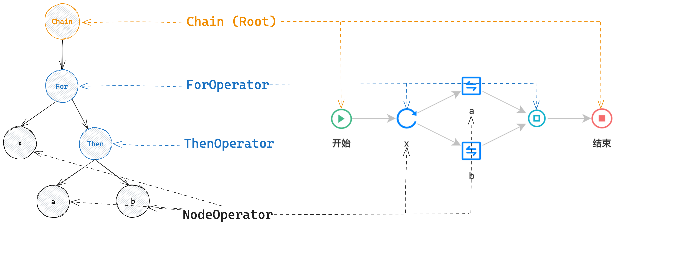

### 2.6 循环编排：WHILE

#### 1、文本（Liteflow EL）表达式

``` typescript
<chain name="chain1">
    WHILE(x).DO(THEN(a, b));
</chain>
```

#### 2、JSON表示形式

```typescript
{
    "type": "WHILE",
    "condition": { "type": "WhileComponent", "id": "x" },
    "children": [
        {
            "type": "THEN",
            "children": [
                { "type": "NodeComponent", "id": "a" },
                { "type": "NodeComponent", "id": "b" },
            ]
        }
    ]
}
```

#### 3、通过节点模型进行表示

```typescript
                                          ┌─────────────────┐
                                      ┌──▶│  NodeOperator   │
  ┌─────────┐    ┌─────────────────┐  │   └─────────────────┘      ┌─────────────────┐
  │  Chain  │───▶│  WhileOperator  │──┤   ┌─────────────────┐  ┌──▶│  NodeOperator   │
  └─────────┘    └─────────────────┘  └──▶│  ThenOperator   │──┤   └─────────────────┘
                                          └─────────────────┘  │   ┌─────────────────┐
                                                               └──▶│  NodeOperator   │
                                                                   └─────────────────┘
```

#### 4、可视化设计与实现

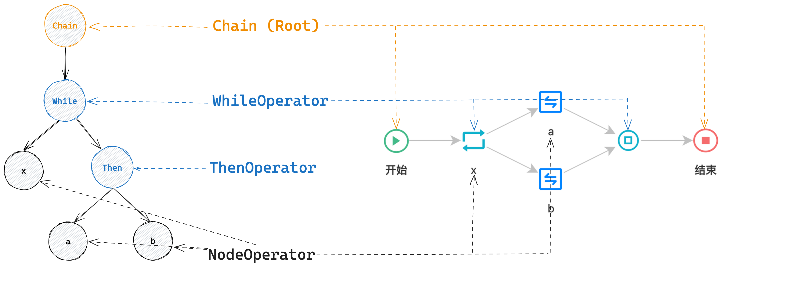


# 04-操作逻辑篇（Control）

回顾一下我们在《[先导篇](https://juejin.cn/spost/7365694439568343080)》中提到过的内容，作为一名前端开发，我们需要特别关注的要素有三个——数据（Model）、视图（View）和逻辑（Control），即“MVC”——我接下来也是使用“MVC三要素”的知识框架来进行LiteFlow逻辑可视化编排系统的拆解、组合、设计和实现的：


在《[数据模型篇](https://juejin.cn/spost/7366557738267426850)》，我们完成了EL表达式的操作符（Operator）的建模工作，最终我们将EL表达式建模成了由ELNode组成的一棵树：


在《[视图呈现篇](https://juejin.cn/spost/7367611991362912308)》，我们完成了使用AntV X6的节点（Node）和边（Edge）进行ELNode的逻辑可视化呈现：


接下来，我们将实现[LiteFlow](https://liteflow.cc/)逻辑可视化编排的“编排”部分实现了：


我们对“编排”的操作逻辑做进一步的拆解，也就是我们常说的“增删改查”（CRUD）操作了，在这里的具体实现，就是对ELNode模型的树型结构进行“增删改查”：


## 1、ELNode模型的增删改查

我们实现的[LiteFlow](https://liteflow.cc/)逻辑可视化编排的增删改查，最终是通过调用ELNode模型的相应方法来实现的，其中定义的部分方法如下：

```typescript
export default abstract class ELNode {
  /////// 接着上面步骤 1.数据模型（Model）
  /**
   * 添加子节点
   * @param child 子节点
   * @param index 指定位置
   */
  public appendChild(child: ELNode, index?: number);

  /**
   * 删除指定的子节点
   * @param child 子节点
   */
  public removeChild(child: ELNode): boolean;
  
  /**
   * 创建新的节点
   * @param parent 父节点
   */
  public create(parent: ELNode, type?: NodeTypeEnum): ELNode

  /**
   * 删除当前节点
   */
  public remove(): boolean;

  /**
   * 转换为X6的图数据格式
   */
  public toCells(
    previous?: Node,
    cells?: Cell[],
    options?: Record<string, any>,
  ): Cell[] | Node;
  
  /**
   * 转换为EL表达式字符串
   */
  public toEL(): string;
}
```

目前我们这个[LiteFlow](https://liteflow.cc/)逻辑可视化编辑器的功能原型，页面大体是经典的“左中右”3栏布局，内容由以下4个面板组成：左侧的“物料区”、中间的“画布区”、右侧的“设置区”，以及顶部的“工具栏”：

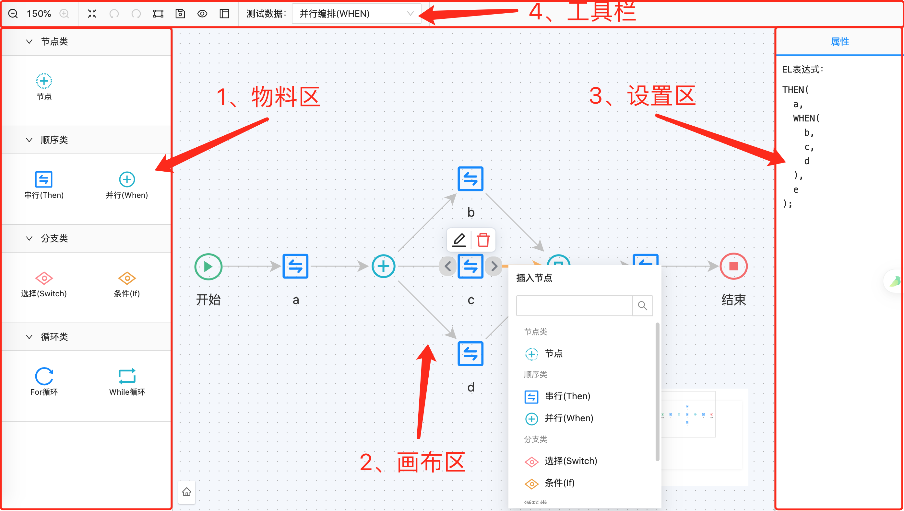

- 1. 物料区：在页面的左侧是“物料区”，这里提供了可供选择的各类逻辑组件，主要包括： <br/>
① 节点类：在实际项目中，节点将会是最多的，这里为了方便只放了一个节点组件，组件的id属性会随机生成为"Placeholder[1-9]"形式； <br/>
② 顺序类：串行编排THEN、并行编排WHEN； <br/>
③ 分支类：选择编排SWITCH、条件编排IF； <br/>
④ 循环类：FOR循环、WHILE循环。 <br/>
通过拖拽左侧物料区的各个逻辑组件到中间画布，可以实现组件节点的新增和修改。
- 2. 画布区：页面中间最大的区域是画布区，整个LiteFlow的逻辑可视化在这里进行的呈现，除了逻辑可视化的主要内容“节点”和“边”之外，同时在节点和边上有相关的操作按钮，可以方便进行逻辑组件的“增删改查”操作，目前主要包括的可用操作如下：
① 节点上的可用操作：在节点前面/后面插入节点，替换当前节点，删除当前节点；
② 边上的可用操作：在边所在的位置插入节点（相当于在边前面的节点后面插入新节点）。
- 3. 设置区：在页面右侧是设置区，默认显示LiteFlow的EL表达式；在选中某个逻辑节点组件之后，则显示该组件可设置的属性，比如LiteFlow常用的id和tag等属性；
- 4. 工具栏：在页面顶部是工具栏，包含LiteFlow逻辑可视化编排时常用的画布缩放、撤销/重做等等功能。

接下来，我们对[LiteFlow](https://liteflow.cc/)逻辑可视化编排的“增删改”分别进行讲解。

## 2、新增（Create）

### 2.1 通过拖拽新增

在左侧物料区，可以通过拖拽需要的逻辑组件到中间的画布区、实现逻辑组件的新增：

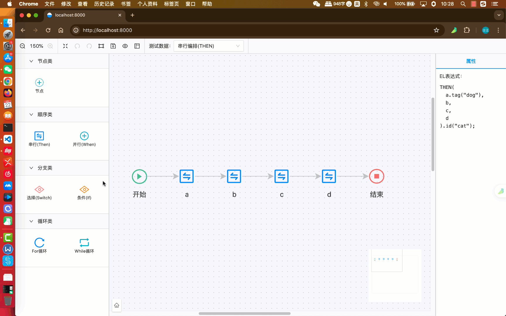


这里的拖拽节点到画布的实现，是使用了AntV X6的[Addon.Dnd](https://x6.antv.vision/zh/docs/tutorial/basic/dnd)，简化后的实现方法如下：

```typescript
const dnd = useMemo(
    () =>
      new Addon.Dnd({
        target: flowGraph,
        scaled: true,
        validateNode: (droppingNode: Node) => {
          const position = droppingNode.getPosition();
          const { node } = droppingNode.getData();
          const cellViewsFromPoint = flowGraph.findViewsFromPoint(
            position.x,
            position.y,
          );
          let cellViews =
            cellViewsFromPoint.filter((cellView) => cellView.isEdgeView()) ||
            [];
          if (cellViews && cellViews.length) {
            const currentEdge = flowGraph.getCellById(
              cellViews[0].cell.id,
            ) as Edge | null;
            let targetNode = currentEdge.getTargetNode();
            let { model: targetModel } = targetNode?.getData<INodeData>() || {};
            targetModel?.append(
              ELBuilder.createELNode(node.type, targetModel),
            );
          }
          
          return false;
        },
      }),
    [flowGraph],
  );
```
在这里我们做了这么一个设计——只有拖拽节点到画布中的边上、才能新增节点——因此在上面`validateNode`方法的最后、返回了`false`。

### 2.2 通过快捷面板（ContextPad）新增

在中间的画布区的节点和边上，有相关的操作按钮，可以方便进行逻辑组件的新增操作：
① 节点附近新增：在节点前面/后面插入节点；

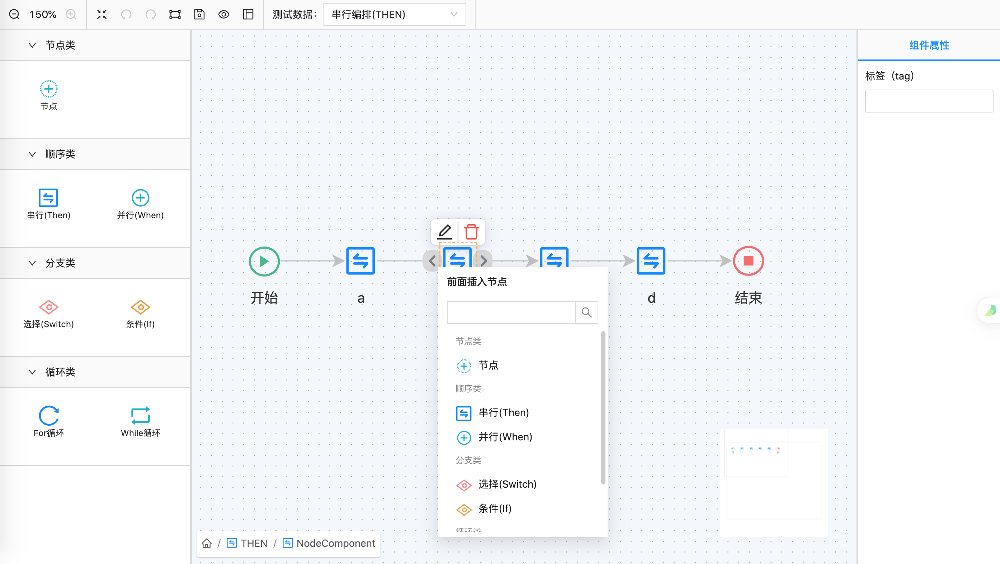

② 边上新增：在边所在的位置插入节点（相当于在边前面的节点后面插入新节点）。

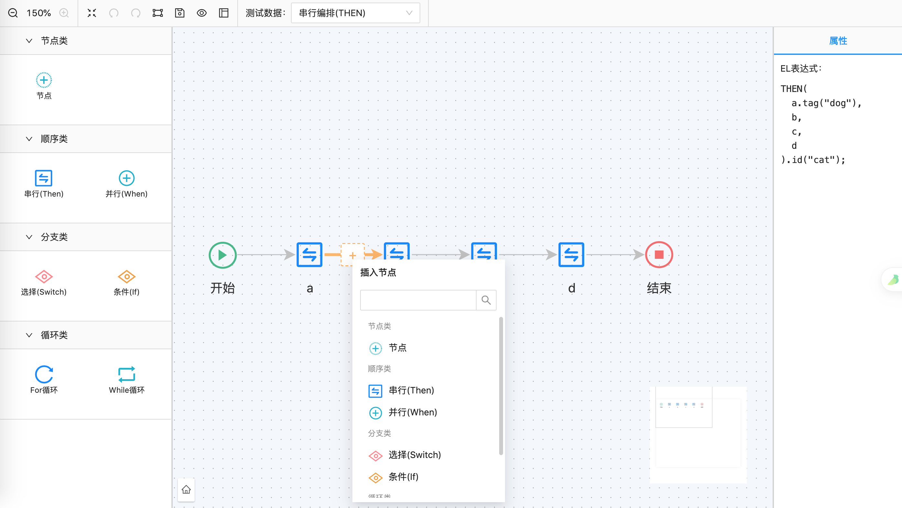

这里我们设计了一个ContextPad组件、用来快捷插入节点——这样就实现了不通过拖拽、而是直接在画布中进行组件的新增。

这里ContextPad组件的实现，是通过使用AntV X6的[自定义事件机制](https://x6.antv.vision/zh/docs/tutorial/intermediate/events)，唤起ContextPad组件的实现代码如下：

```typescript
const showContextPad = debounce((info: any) => {
  node.model?.graph?.trigger('graph:showContextPad', info);
}, 100);
const onPrepend = (event: any) => {
  showContextPad({
    x: event.clientX,
    y: event.clientY,
    node,
    scene: 'prepend',
    title: '前面插入节点',
    edge: null,
  });
};
const onAppend = (event: any) => {
  showContextPad({
    x: event.clientX,
    y: event.clientY,
    node,
    scene: 'append',
    title: '后面插入节点',
    edge: null,
  });
};
```

## 3、修改（Update）

### 2.1 通过拖拽修改

在左侧物料区，可以通过拖拽需要的逻辑组件到中间的画布区的组件节点上、实现该组件节点的替换：


### 2.2 通过快捷面板（ContextPad）修改

在中间的画布区，节点的工具栏上有一个替换按钮，可以方便进行逻辑组件的替换操作：

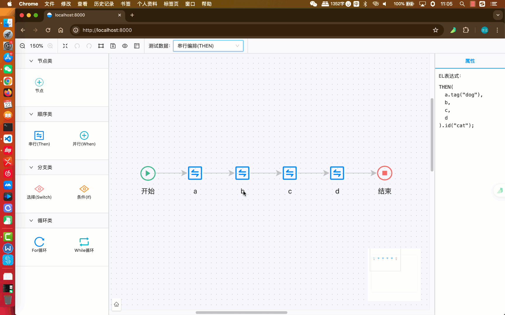

### 2.3 通过设置面板修改

在页面右侧是设置区，在选中某个逻辑节点组件之后，可以设置该组件的LiteFlow属性，比如id和tag等等：


## 4、删除（Delete）

### 4.1 通过工具栏删除

在中间的画布区，节点的工具栏上有一个删除按钮，可以方便进行逻辑组件的删除操作：


### 4.2 通过快捷键删除

在中间的画布区，我们可以通过快捷键`backspace`或者`delete`进行删除，比如这里我通过`ctrl + a`进行组件全选，然后按`delete`键进行了删除：


这里的实现比较简单，实现代码如下：

```typescript
flowGraph.bindKey(['backspace', 'del'], () => {
  const toDelCells = flowGraph
    .getSelectedCells()
    .filter((cell) => cell.isNode());
  if (toDelCells.length) {
    Modal.confirm({
      title: `确认要删除选中的节点？`,
      content: '点击确认按钮进行删除，点击取消按钮返回',
      onOk() {
        toDelCells.forEach((node) => {
          const { model } = node.getData() || {};
          model?.remove?.();
        });
        history.push();
      },
    });
  }
  return false;
});
```

需要注意的是，我们在使用AntV X6进行以上交互实现时，关键的API的是都是通过调用`Graph`的相关方法实现的。如果大家也使用AntV X6进行类似的图可视化编辑器实现时，所以推荐大家对`Graph`的相关API一定要熟悉。